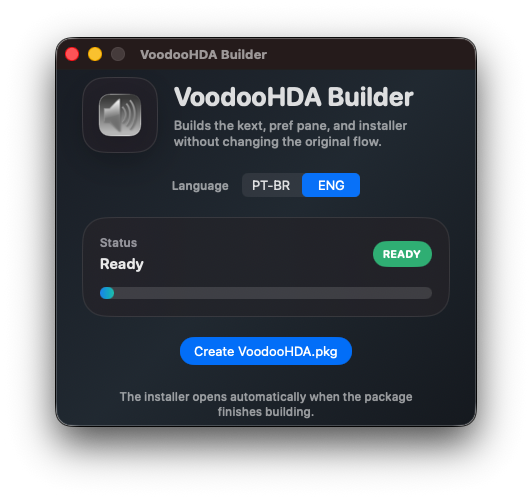
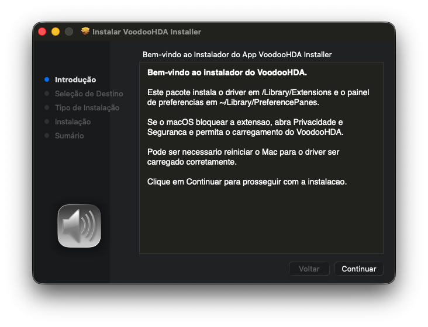

# VoodooHDA Builder

Projeto do app macOS que automatiza o build e o empacotamento do VoodooHDA.

O repositório publicado deve conter apenas os arquivos do builder. O clone local de `VoodooHDA/` nao entra aqui, porque ele e baixado separadamente do repositório original e usado apenas como base de build.

Na raiz do repositório existe um workspace `VoodooHDA-Builder.xcworkspace` que aponta para o projeto real do app em `VoodooBuilderApp/VoodooBuilderApp.xcodeproj`.

## Requisitos

- macOS 13 ou mais recente
- Processadores intel (não funciona com a séria M Apple Silicom arm64)
- Xcode instalado
- Xcode Command Line Tools instaladas com `xcode-select --install`
- Git disponível no sistema
- conexão com a internet para o clone automático de `VoodooHDA` e `MacKernelSDK`

Python nao e necessario para o app rodar nem para o pipeline principal.

## Quick Start

Clone este projeto e abra a pasta no Finder:

```bash
git clone https://github.com/maxpicelli/VoodooHDA-Builder.git && cd VoodooHDA-Builder && open .
```

Ou clone e abra direto no Xcode:

```bash
git clone https://github.com/maxpicelli/VoodooHDA-Builder.git && cd VoodooHDA-Builder && open VoodooHDA-Builder.xcworkspace
```

Depois abra o app. Se `VoodooHDA` ou `MacKernelSDK` nao existirem no workspace escolhido, o builder faz o clone automaticamente.

O builder tenta reutilizar clones locais existentes, mas tambem consegue baixar automaticamente o `VoodooHDA` e o `MacKernelSDK` quando eles ainda nao existem no workspace.

## Estrutura esperada no workspace

```text
Voodoo-HDA-builder-compiler/
├── VoodooBuilderApp/
├── VoodooHDA/
└── MacKernelSDK/
```

## Abrir no Xcode

```bash
open VoodooHDA-Builder.xcworkspace
```

Ou abra [Open VoodooHDA Builder in Xcode.command](Open%20VoodooHDA%20Builder%20in%20Xcode.command) com duplo clique no Finder para abrir direto o workspace no Xcode.

No VS Code, tambem da para usar `Run Task` e executar `Open VoodooHDA Builder in Xcode`.

## Rodar pelo terminal

```bash
cd VoodooBuilderApp
swift run
```

## Capturas de tela

### App



### Instalador



## O que o app faz

- reutiliza ou baixa o clone local de `VoodooHDA`
- reutiliza ou baixa o `MacKernelSDK`
- cria o link simbolico `VoodooHDA/MacKernelSDK`
- compila `VoodooHDA.prefPane`
- compila `VoodooHDA.kext`
- copia os artefatos `Release` para a pasta do instalador
- gera o `VoodooHDA.pkg`
- copia o `.pkg` final para a Mesa
- aplica o icone do pref pane ao pacote final

## Notas

- `VoodooHDA/` e uma dependencia local e fica fora deste repositório.
- o app clona ou atualiza automaticamente `VoodooHDA/` e `MacKernelSDK/` quando necessario.
- artefatos de build do Xcode e do SwiftPM tambem ficam ignorados.
