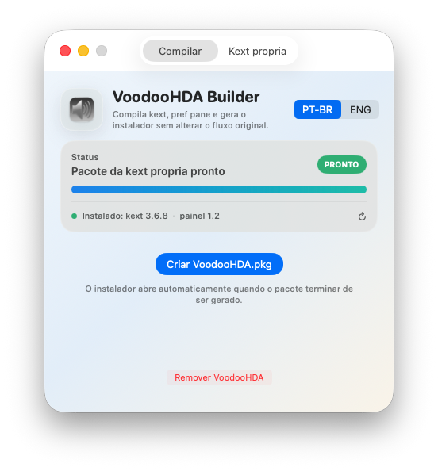
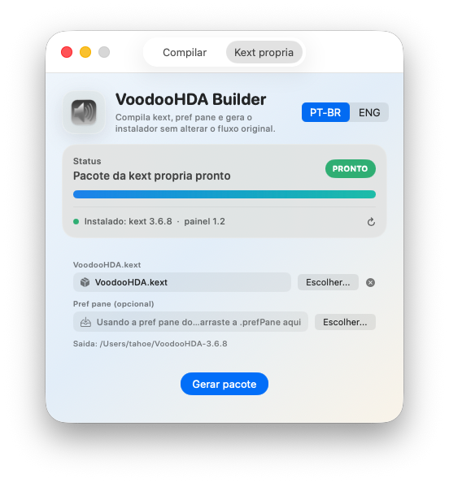
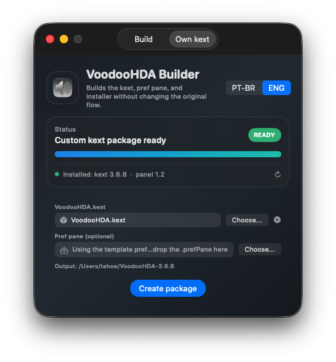

# VoodooHDA Builder

**Português** · [English](#english)

Projeto do app macOS que automatiza o build e o empacotamento do VoodooHDA.

O repositório publicado deve conter apenas os arquivos do builder. O clone local de `VoodooHDA/` nao entra aqui, porque ele e baixado separadamente do repositório original e usado apenas como base de build.

Na raiz do repositório existe um workspace `VoodooHDA-Builder.xcworkspace` que aponta para o projeto real do app em `VoodooBuilderApp/VoodooBuilderApp.xcodeproj`.

## Requisitos

- macOS 13 ou mais recente
- Macs Intel ou Apple Silicon (M1 ate M4). Em Apple Silicon o builder compila em cross para `x86_64`, que e o alvo do VoodooHDA
- Xcode instalado
- Xcode Command Line Tools instaladas com `xcode-select --install`
- Git disponível no sistema
- conexão com a internet para o clone automático de `VoodooHDA` e `MacKernelSDK`

Python nao e necessario para o app rodar nem para o pipeline principal.

## Quick Start

Clone este projeto e abra a pasta no Finder:

```bash
git clone https://github.com/maxpicelli/VoodooHDA-Builder.git && cd VoodooHDA-Builder && open .
```

Ou clone e abra direto no Xcode:

```bash
git clone https://github.com/maxpicelli/VoodooHDA-Builder.git && cd VoodooHDA-Builder && open VoodooHDA-Builder.xcworkspace
```

Depois abra o app. Se `VoodooHDA` ou `MacKernelSDK` nao existirem no workspace escolhido, o builder faz o clone automaticamente.

O builder tenta reutilizar clones locais existentes, mas tambem consegue baixar automaticamente o `VoodooHDA` e o `MacKernelSDK` quando eles ainda nao existem no workspace.

## Estrutura esperada no workspace

```text
Voodoo-HDA-builder-compiler/
├── VoodooBuilderApp/
├── VoodooHDA/
└── MacKernelSDK/
```

## Abrir no Xcode

```bash
open VoodooHDA-Builder.xcworkspace
```

Ou abra [Open VoodooHDA Builder in Xcode.command](Open%20VoodooHDA%20Builder%20in%20Xcode.command) com duplo clique no Finder para abrir direto o workspace no Xcode.

No VS Code, tambem da para usar `Run Task` e executar `Open VoodooHDA Builder in Xcode`.

## Rodar pelo terminal

```bash
cd VoodooBuilderApp
swift run
```

## Capturas de tela

### Aba `Compilar`



### Aba `Kext propria`



### Instalador


## O que o app faz

O app tem duas abas.

### Aba `Compilar`

- reutiliza ou baixa o clone local de `VoodooHDA`
- reutiliza ou baixa o `MacKernelSDK`
- cria o link simbolico `VoodooHDA/MacKernelSDK`
- compila `VoodooHDA.prefPane`
- compila `VoodooHDA.kext`
- copia os artefatos `Release` para a pasta do instalador
- gera o `VoodooHDA.pkg` em `~/VoodooHDA-Installer-Work`
- aplica o icone do pref pane ao pacote final
- botao `Remover VoodooHDA` apaga a kext, o pref pane e os arquivos relacionados do sistema

### Aba `Kext propria`

Empacota uma `VoodooHDA.kext` que voce ja tem, sem compilar nada.

- escolha a `.kext` pelo botao `Escolher...` ou arraste o bundle do Finder para o campo
- opcionalmente escolha ou arraste uma `.prefPane` propria; se deixar vazio, usa a do template
- a versao e lida do `Info.plist` da kext e usada para nomear a pasta de saida
- gera `Kext.pkg`, `prefpane.pkg`, `getdump.pkg` e `VoodooHDA.pkg` em `~/VoodooHDA-<versao>`, separado do fluxo principal
- ajusta automaticamente os `version=` do `dist.xml` conforme os bundles escolhidos

### Versao instalada

O cartao de status mostra a versao do VoodooHDA instalado neste Mac, lida de:

- `/Library/Extensions/VoodooHDA.kext` (ou `/System/Library/Extensions`)
- `~/Library/PreferencePanes/VoodooHDA.prefPane` (ou `/Library/PreferencePanes`)

## Notas

- `VoodooHDA/` e uma dependencia local e fica fora deste repositório.
- o app clona ou atualiza automaticamente `VoodooHDA/` e `MacKernelSDK/` quando necessario.
- a aba `Kext propria` nao precisa do clone do `VoodooHDA` nem do `MacKernelSDK`.
- artefatos de build do Xcode e do SwiftPM tambem ficam ignorados.

---

<a id="english"></a>

# VoodooHDA Builder

[Português](#voodoohda-builder) · **English**

macOS app that automates building and packaging VoodooHDA.

The published repository should contain only the builder files. The local `VoodooHDA/` clone does not belong here: it is downloaded separately from the original repository and used only as a build base.

At the repository root there is a `VoodooHDA-Builder.xcworkspace` workspace pointing to the real app project at `VoodooBuilderApp/VoodooBuilderApp.xcodeproj`.

## Requirements

- macOS 13 or newer
- Intel or Apple Silicon Macs (M1 through M4). On Apple Silicon the builder cross-compiles to `x86_64`, which is the VoodooHDA target
- Xcode installed
- Xcode Command Line Tools installed with `xcode-select --install`
- Git available on the system
- internet connection for the automatic clone of `VoodooHDA` and `MacKernelSDK`

Python is not required to run the app or the main pipeline.

## Quick Start

Clone this project and open the folder in Finder:

```bash
git clone https://github.com/maxpicelli/VoodooHDA-Builder.git && cd VoodooHDA-Builder && open .
```

Or clone and open it straight in Xcode:

```bash
git clone https://github.com/maxpicelli/VoodooHDA-Builder.git && cd VoodooHDA-Builder && open VoodooHDA-Builder.xcworkspace
```

Then open the app. If `VoodooHDA` or `MacKernelSDK` do not exist in the chosen workspace, the builder clones them automatically.

The builder tries to reuse existing local clones, but it can also download `VoodooHDA` and `MacKernelSDK` when they are not in the workspace yet.

## Expected workspace layout

```text
Voodoo-HDA-builder-compiler/
├── VoodooBuilderApp/
├── VoodooHDA/
└── MacKernelSDK/
```

## Open in Xcode

```bash
open VoodooHDA-Builder.xcworkspace
```

Or double-click [Open VoodooHDA Builder in Xcode.command](Open%20VoodooHDA%20Builder%20in%20Xcode.command) in Finder to open the workspace directly in Xcode.

In VS Code you can also use `Run Task` and run `Open VoodooHDA Builder in Xcode`.

## Run from the terminal

```bash
cd VoodooBuilderApp
swift run
```

## Screenshots

### `Build` tab



### `Own kext` tab


### Installer


## What the app does

The app has two tabs.

### `Build` tab

- reuses or downloads the local `VoodooHDA` clone
- reuses or downloads `MacKernelSDK`
- creates the `VoodooHDA/MacKernelSDK` symlink
- builds `VoodooHDA.prefPane`
- builds `VoodooHDA.kext`
- copies the `Release` artifacts to the installer folder
- generates `VoodooHDA.pkg` in `~/VoodooHDA-Installer-Work`
- applies the pref pane icon to the final package
- the `Remove VoodooHDA` button deletes the kext, the pref pane and related files from the system

### `Own kext` tab

Packages a `VoodooHDA.kext` you already have, without compiling anything.

- pick the `.kext` with the `Choose...` button or drag the bundle from Finder onto the field
- optionally pick or drag your own `.prefPane`; if left empty, the template one is used
- the version is read from the kext `Info.plist` and used to name the output folder
- generates `Kext.pkg`, `prefpane.pkg`, `getdump.pkg` and `VoodooHDA.pkg` in `~/VoodooHDA-<version>`, separate from the main flow
- automatically adjusts the `version=` entries in `dist.xml` to match the chosen bundles

### Installed version

The status card shows the VoodooHDA version installed on this Mac, read from:

- `/Library/Extensions/VoodooHDA.kext` (or `/System/Library/Extensions`)
- `~/Library/PreferencePanes/VoodooHDA.prefPane` (or `/Library/PreferencePanes`)

## Notes

- `VoodooHDA/` is a local dependency and stays outside this repository.
- the app clones or updates `VoodooHDA/` and `MacKernelSDK/` automatically when needed.
- the `Own kext` tab does not need the `VoodooHDA` clone nor `MacKernelSDK`.
- Xcode and SwiftPM build artifacts are ignored as well.
